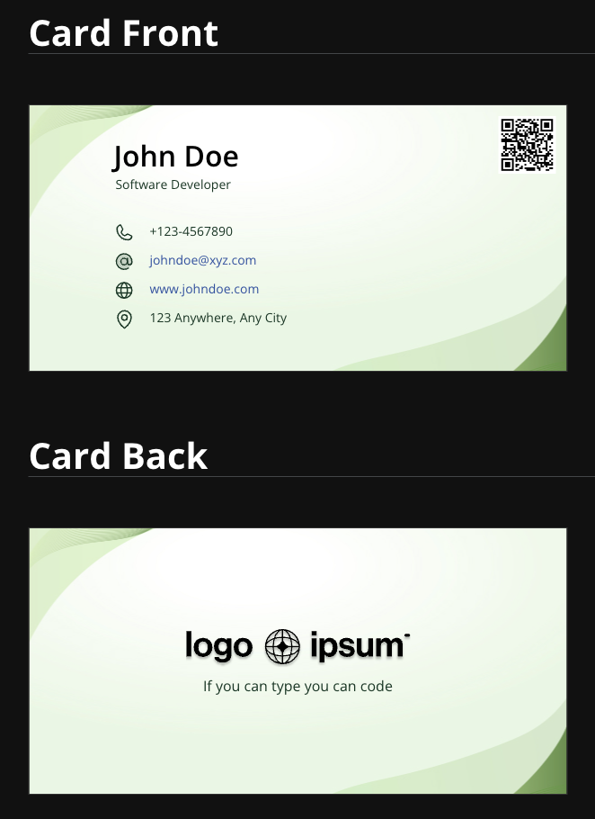

# Overview

[Green Leaf Business Card](https://gsalunke.github.io/green-leaf-card/) will help you create your beautiful business card in no time.

It provides out-of-the-box documentation features that can be used to create any
business card of your choice.

# Preview

## Get Rolling

[Click here](https://gsalunke.github.io/green-leaf-card/) to learn how to use this template.

# [Dive into the Docs](https://gsalunke.github.io/green-leaf-card/)

## Created using [fastn](https://fastn.com/) - [Business Card Template](https://github.com/fastn-community/business-card-template)

## fastn and Curious?

Discover more of [fastn](https://fastn.com/) here.

- [Expander Crash Course](https://fastn.com/expander/)
- [Video Tutorials](https://fastn.com/expander/hello-world/-/build/)
- [Explore more Templates/ Components/ Package](https://fastn.com/featured/)

## Become a [fastn](https://fastn.com/) Contributor

1.  Finish the [Expander Crash Course](https://fastn.com/expander/)
2.  Share your progress and ideas on [Discord](https://discord.gg/bucrdvptYd).
3.  Let [fastn](https://fastn.com/) team guide you on your contributor journey.

## Become a fastn-trailblazer

- [Join fastn Discord Server](https://discord.gg/bucrdvptYd) to connect with other [fastn](https://fastn.com/) enthusiasts and stay up to date with the latest developments.
- [Star fastn on GitHub](https://github.com/fastn-stack/fastn/)
